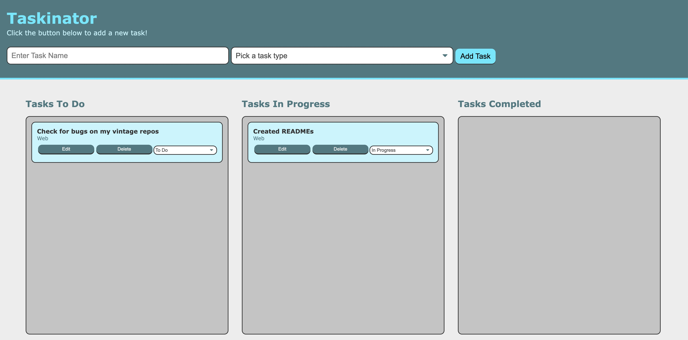

# Taskinator by CS

This is my personal task organizer that can be split up between print, web, or mobile type jobs. 

After naming and saving all the tasks, the user can place them under ‘In Progress’ or ‘Tasks Completed’

Tasks are saved using the local storage API. Tasks can be deleted or edited. If you wish to use this app, please download it locally, but the my personal organizer link is provided below for viewers to see the app’s functionality. 

Link: https://cesarsiguencia.github.io/taskinator

